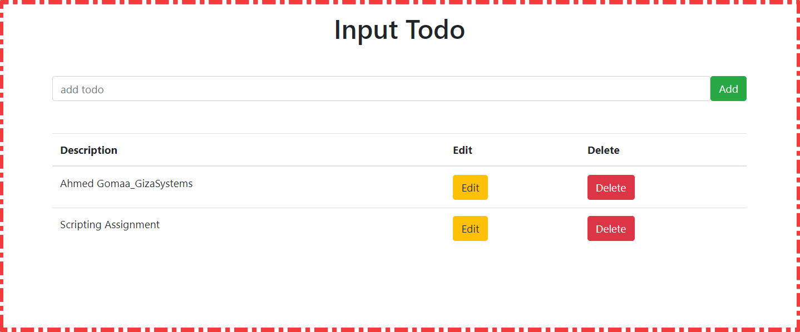
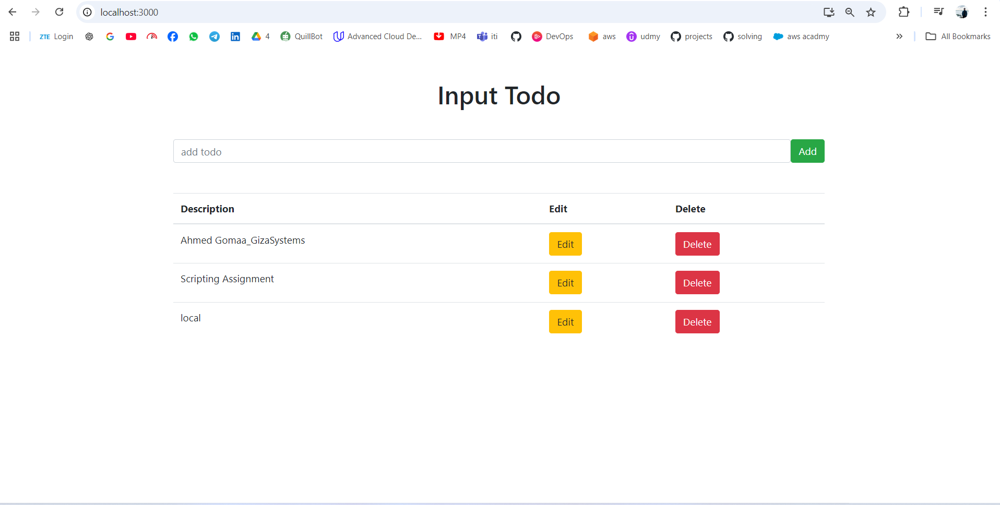
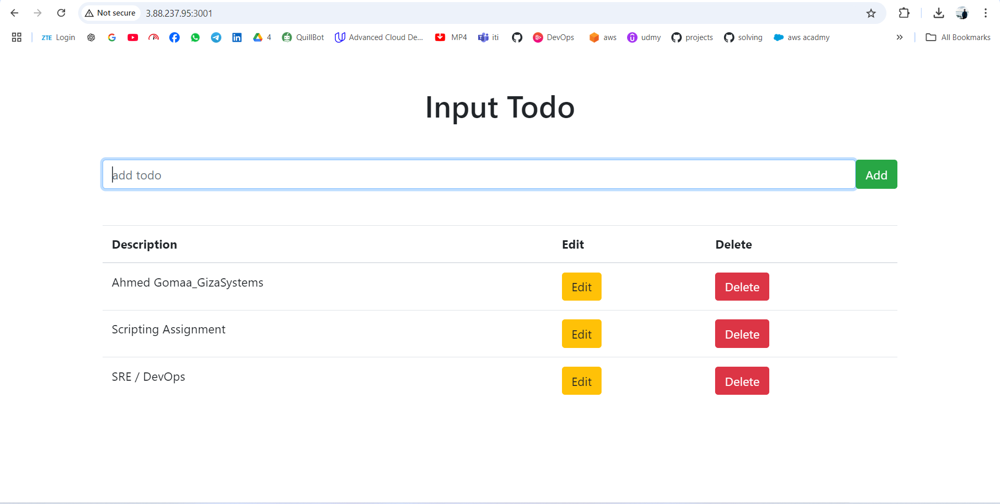
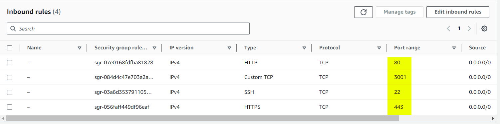
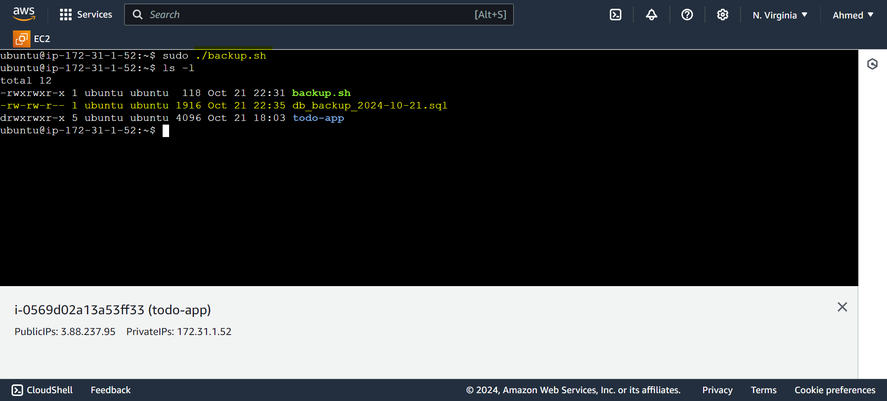

# Task Tracker Web Application (PERN Stack)


## Overview
This project is a full-stack **Task Tracker** web application, built using the **PERN** stack (PostgreSQL, Express, React, Node.js). The application features basic CRUD (Create, Read, Update, Delete) functionality for managing tasks. It integrates a React frontend with a Node.js backend, and the data is stored in a PostgreSQL database. The app is containerized with **Docker** and includes automation scripts for deployment and management on a cloud virtual machine (VM).
<?xml version="1.0" encoding="utf-8" standalone="yes"?>
<!DOCTYPE svg PUBLIC "-//W3C//DTD SVG 1.1//EN" "http://www.w3.org/Graphics/SVG/1.1/DTD/svg11.dtd">
<svg width="584" height="383" viewBox="0 0 584 383" style="fill:none;stroke:none;fill-rule:evenodd;clip-rule:evenodd;stroke-linecap:round;stroke-linejoin:round;stroke-miterlimit:1.5;" version="1.1" xmlns="http://www.w3.org/2000/svg" xmlns:xlink="http://www.w3.org/1999/xlink"><style id="fontImports">@import url("https://fonts.googleapis.com/css2?family=Roboto:wght@400;700&amp;display=block");</style><g id="items" style="isolation: isolate"><g id="blend" style="mix-blend-mode:multiply"><g id="g-root-5.cu_sy_v2zrsr1u1ac-fill" data-item-order="999959236" data-item-id="5.cu_sy_v2zrsr1u1ac" data-item-class="Part Indexed Fill Stroke" data-item-index="5" data-renderer-id="0" transform="translate(3, 296.77020263671875)"><g id="5.cu_sy_v2zrsr1u1ac-fill" stroke="none" fill="#ebe6ff"><g><path d="M 127.865599 20.2322C 127.072599 29.7108 98.925799 34.4164 70.438399 39.6509C 49.240499 43.546 29.886599 45.288 22.274199 47.0136C 16.031099 48.4288 9.999999 52.8286 10.565499 61.629C 10.909699 66.9868 14.232099 71.4046 22.274199 72.035C 31.965999 72.7948 48.632699 69.9303 75.757899 65.242C 124.527599 56.8124 141.431599 48.3751 141.431599 31.5084C 141.431599 20.2322 126.082599 12.281 119.205599 10C 123.373599 11.6633 128.339599 14.562 127.865599 20.2322Z"></path></g></g></g><g id="g-root-5.cu_1_sy_hrj9ff1u2v9-fill" data-item-order="999959238" data-item-id="5.cu_1_sy_hrj9ff1u2v9" data-item-class="Part Indexed Fill Stroke" data-item-index="5" data-renderer-id="0" transform="translate(6.224365234375, 290.4970703125)"><g id="5.cu_1_sy_hrj9ff1u2v9-fill" stroke="none" fill="#ebe6ff"><g><path d="M 38.0076 27.1771C 16.9757 24.0392 10.9029 18.5537 10 17.5313C 11.8743 19.5171 14.7922 20.8771 19.0033 21.2053C 28.7014 21.9611 45.379 19.1113 72.522 14.4469C 81.0593 12.9798 88.6207 11.5124 95.2864 10C 102.5445 12.184 110.341 13.5695 117.352 16.811C 120.339 18.2371 124.813 20.893 124.686 26.0148C 124.538 31.9893 114.66 35.7537 102.0009 38.9452C 101.6757 38.8312 100.3044 38.2844 99.9973 38.1713C 92.3051 35.2781 65.1564 31.2276 38.0076 27.1771Z"></path></g></g></g><g id="g-root-4.cu_sy_18ntegr1soaq-fill" data-item-order="999959240" data-item-id="4.cu_sy_18ntegr1soaq" data-item-class="Part Indexed Fill Stroke" data-item-index="4" data-renderer-id="0" transform="translate(3, 239.74609375)"><g id="4.cu_sy_18ntegr1soaq-fill" stroke="none" fill="#f5fbe9"><g><path d="M 127.865599 20.2322C 127.072599 29.7108 98.925799 34.4164 70.438399 39.6509C 49.240499 43.546 29.886599 45.288 22.274199 47.0136C 16.031099 48.4288 9.999999 52.8286 10.565499 61.629C 10.909699 66.9868 14.232099 71.4046 22.274199 72.035C 31.965999 72.7948 48.632699 69.9303 75.757899 65.242C 124.527599 56.8124 141.431599 48.3751 141.431599 31.5084C 141.431599 20.2322 126.082599 12.281 119.205599 10C 123.373599 11.6633 128.339599 14.562 127.865599 20.2322Z"></path></g></g></g><g id="g-root-4.cu_1_sy_zs6e7v1sp3f-fill" data-item-order="999959242" data-item-id="4.cu_1_sy_zs6e7v1sp3f" data-item-class="Part Indexed Fill Stroke" data-item-index="4" data-renderer-id="0" transform="translate(6.224365234375, 233.4736328125)"><g id="4.cu_1_sy_zs6e7v1sp3f-fill" stroke="none" fill="#f5fbe9"><g><path d="M 38.0076 27.1771C 16.9757 24.0392 10.9029 18.5537 10 17.5313C 11.8743 19.5171 14.7922 20.8771 19.0033 21.2053C 28.7014 21.9611 45.379 19.1113 72.522 14.4469C 81.0593 12.9798 88.6207 11.5124 95.2864 10C 102.5445 12.184 110.341 13.5695 117.352 16.811C 120.339 18.2371 124.813 20.893 124.686 26.0148C 124.538 31.9893 114.66 35.7537 102.0009 38.9452C 101.6757 38.8312 100.3044 38.2844 99.9973 38.1713C 92.3051 35.2781 65.1564 31.2276 38.0076 27.1771Z"></path></g></g></g><g id="g-root-3.cu_sy_1qegxvf1sp3c-fill" data-item-order="999959244" data-item-id="3.cu_sy_1qegxvf1sp3c" data-item-class="Part Indexed Fill Stroke" data-item-index="3" data-renderer-id="0" transform="translate(3, 182.720703125)"><g id="3.cu_sy_1qegxvf1sp3c-fill" stroke="none" fill="#e6f9ff"><g><path d="M 127.865599 20.2322C 127.072599 29.7108 98.925799 34.4164 70.438399 39.6509C 49.240499 43.546 29.886599 45.288 22.274199 47.0136C 16.031099 48.4288 9.999999 52.8286 10.565499 61.629C 10.909699 66.9868 14.232099 71.4046 22.274199 72.035C 31.965999 72.7948 48.632699 69.9303 75.757899 65.242C 124.527599 56.8124 141.431599 48.3751 141.431599 31.5084C 141.431599 20.2322 126.082599 12.281 119.205599 10C 123.373599 11.6633 128.339599 14.562 127.865599 20.2322Z"></path></g></g></g><g id="g-root-3.cu_1_sy_1d3mwl71snih-fill" data-item-order="999959246" data-item-id="3.cu_1_sy_1d3mwl71snih" data-item-class="Part Indexed Fill Stroke" data-item-index="3" data-renderer-id="0" transform="translate(6.224365234375, 176.4482421875)"><g id="3.cu_1_sy_1d3mwl71snih-fill" stroke="none" fill="#e6f9ff"><g><path d="M 38.0076 27.1771C 16.9757 24.0392 10.9029 18.5537 10 17.5313C 11.8743 19.5171 14.7922 20.8771 19.0033 21.2053C 28.7014 21.9611 45.379 19.1113 72.522 14.4469C 81.0593 12.9798 88.6207 11.5124 95.2864 10C 102.5445 12.184 110.341 13.5695 117.352 16.811C 120.339 18.2371 124.813 20.893 124.686 26.0148C 124.538 31.9893 114.66 35.7537 102.0009 38.9452C 101.6757 38.8312 100.3044 38.2844 99.9973 38.1713C 92.3051 35.2781 65.1564 31.2276 38.0076 27.1771Z"></path></g></g></g><g id="g-root-2.cu_sy_4ote9n1snpi-fill" data-item-order="999959248" data-item-id="2.cu_sy_4ote9n1snpi" data-item-class="Part Indexed Fill Stroke" data-item-index="2" data-renderer-id="0" transform="translate(3, 125.6962890625)"><g id="2.cu_sy_4ote9n1snpi-fill" stroke="none" fill="#e9fbf3"><g><path d="M 127.865599 20.2322C 127.072599 29.7108 98.925799 34.4164 70.438399 39.6509C 49.240499 43.546 29.886599 45.288 22.274199 47.0136C 16.031099 48.4288 9.999999 52.8286 10.565499 61.629C 10.909699 66.9868 14.232099 71.4046 22.274199 72.035C 31.965999 72.7948 48.632699 69.9303 75.757899 65.242C 124.527599 56.8124 141.431599 48.3751 141.431599 31.5084C 141.431599 20.2322 126.082599 12.281 119.205599 10C 123.373599 11.6633 128.339599 14.562 127.865599 20.2322Z"></path></g></g></g><g id="g-root-2.cu_1_sy_1uuafzv1sob3-fill" data-item-order="999959250" data-item-id="2.cu_1_sy_1uuafzv1sob3" data-item-class="Part Indexed Fill Stroke" data-item-index="2" data-renderer-id="0" transform="translate(6.224365234375, 119.4228515625)"><g id="2.cu_1_sy_1uuafzv1sob3-fill" stroke="none" fill="#e9fbf3"><g><path d="M 38.0076 27.1771C 16.9757 24.0392 10.9029 18.5537 10 17.5313C 11.8743 19.5171 14.7922 20.8771 19.0033 21.2053C 28.7014 21.9611 45.379 19.1113 72.522 14.4469C 81.0593 12.9798 88.6207 11.5124 95.2864 10C 102.5445 12.184 110.341 13.5695 117.352 16.811C 120.339 18.2371 124.813 20.893 124.686 26.0148C 124.538 31.9893 114.66 35.7537 102.0009 38.9452C 101.6757 38.8312 100.3044 38.2844 99.9973 38.1713C 92.3051 35.2781 65.1564 31.2276 38.0076 27.1771Z"></path></g></g></g><g id="g-root-1.cu_sy_18mkgaj1sm4j-fill" data-item-order="999959252" data-item-id="1.cu_sy_18mkgaj1sm4j" data-item-class="Part Indexed Indexed_1 Fill Stroke" data-item-index="1" data-renderer-id="0" transform="translate(3, 68.671875)"><g id="1.cu_sy_18mkgaj1sm4j-fill" stroke="none" fill="#e6efff"><g><path d="M 127.865599 20.2322C 127.072599 29.7108 98.925799 34.4164 70.438399 39.6509C 49.240499 43.546 29.886599 45.288 22.274199 47.0136C 16.031099 48.4288 9.999999 52.8286 10.565499 61.629C 10.909699 66.9868 14.232099 71.4046 22.274199 72.035C 31.965999 72.7948 48.632699 69.9303 75.757899 65.242C 124.527599 56.8124 141.431599 48.3751 141.431599 31.5084C 141.431599 20.2322 126.082599 12.281 119.205599 10C 123.373599 11.6633 128.339599 14.562 127.865599 20.2322Z"></path></g></g></g><g id="g-root-1.cu_1_sy_zqxg1n1smx8-fill" data-item-order="999959254" data-item-id="1.cu_1_sy_zqxg1n1smx8" data-item-class="Part Indexed Indexed_1 Fill Stroke" data-item-index="1" data-renderer-id="0" transform="translate(3.5655517578125, 49.37811279296875)"><g id="1.cu_1_sy_zqxg1n1smx8-fill" stroke="none" fill="#e6efff"><g><path d="M 21.6823 10.759802C 31.374 10.000002 48.067 12.416802 75.1922 17.105202C 90.003 19.665202 106.1882 23.441602 120.011 29.832302C 122.998 31.258302 127.472 33.914302 127.345 39.036102C 127.196 45.010602 117.319 48.775002 104.6598 51.966502C 104.3346 51.852502 102.9633 51.305702 102.6561 51.192602C 78.8756 42.248102 51.5585 39.866802 26.2368 35.826002C 24.7636 36.385802 21.9403 36.588802 20.221 36.385802C 15.9301 35.288202 10 31.995102 10 23.070502C 10 18.441102 13.6401 11.390202 21.6823 10.759802Z"></path></g></g></g><g id="g-root-1.Ellipse_sy_i09wmz1sm4l-fill" data-item-order="999959256" data-item-id="1.Ellipse_sy_i09wmz1sm4l" data-item-class="Part Indexed Indexed_1 Fill Stroke" data-item-index="1" data-renderer-id="0" transform="translate(3.5270843505859375, 50.178955078125)"><g id="1.Ellipse_sy_i09wmz1sm4l-fill" stroke="none" fill="#e6efff"><g><path d="M 10.001843 22.846066C 9.999999 29.94019 15.500659 35.692136 22.286706 35.692136C 29.072752 35.692136 34.573413 29.94019 34.571569 22.846066C 34.573413 15.751942 29.072752 9.999996 22.286706 9.999996C 15.500659 9.999996 9.999999 15.751942 10.001843 22.846066"></path></g></g></g><g id="g-root-tx_developm_1uo1p4r1u0wb-fill" data-item-order="1000000000" data-item-id="tx_developm_1uo1p4r1u0wb" data-item-class="Label Stroke Title" data-item-index="none" data-renderer-id="0" transform="translate(45.528594970703125, 2)"><g id="tx_developm_1uo1p4r1u0wb-fill" stroke="none" fill="#484848"><g><text style="font: 20px Roboto, sans-serif; white-space: pre;"><tspan x="11.82" y="34" dominant-baseline="ideographic">Development and Deployment of Task Tracker Application</tspan></text></g></g></g><g id="g-root-tech_1ur65q31pszu-fill" data-item-order="1000000000" data-item-id="tech_1ur65q31pszu" data-item-class="Icon Stroke Indexed Indexed_1" data-item-index="1" data-renderer-id="0" transform="translate(171.52859497070312, 68)"></g><g id="g-root-tx_identify_hteoor1u1vm-fill" data-item-order="1000000000" data-item-id="tx_identify_hteoor1u1vm" data-item-class="Label Stroke Indexed Indexed_1" data-item-index="1" data-renderer-id="0" transform="translate(219.52859497070312, 74)"><g id="tx_identify_hteoor1u1vm-fill" stroke="none" fill="#484848"><g><text style="font: 20px Roboto, sans-serif; white-space: pre;"><tspan x="12" y="34" dominant-baseline="ideographic">Identify Technologies</tspan></text></g></g></g><g id="g-root-1_mccnej1pt6x-fill" data-item-order="1000000000" data-item-id="1_mccnej1pt6x" data-item-class="Icon Stroke Indexed" data-item-index="2" data-renderer-id="0" transform="translate(171.52859497070312, 128)"></g><g id="g-root-tx_developw_zk283f1u2o9-fill" data-item-order="1000000000" data-item-id="tx_developw_zk283f1u2o9" data-item-class="Label Stroke Indexed" data-item-index="2" data-renderer-id="0" transform="translate(219.52859497070312, 134)"><g id="tx_developw_zk283f1u2o9-fill" stroke="none" fill="#484848"><g><text style="font: 20px Roboto, sans-serif; white-space: pre;"><tspan x="12" y="34" dominant-baseline="ideographic">Develop Web Application</tspan></text></g></g></g><g id="g-root-dock_v648e31pte0-fill" data-item-order="1000000000" data-item-id="dock_v648e31pte0" data-item-class="Icon Stroke Indexed" data-item-index="3" data-renderer-id="0" transform="translate(171.52859497070312, 188)"></g><g id="g-root-tx_containe_1cviqgr1u13c-fill" data-item-order="1000000000" data-item-id="tx_containe_1cviqgr1u13c" data-item-class="Label Stroke Indexed" data-item-index="3" data-renderer-id="0" transform="translate(219.52859497070312, 194)"><g id="tx_containe_1cviqgr1u13c-fill" stroke="none" fill="#484848"><g><text style="font: 20px Roboto, sans-serif; white-space: pre;"><tspan x="12" y="34" dominant-baseline="ideographic">Containerize with Docker</tspan></text></g></g></g><g id="g-root-2_1lses1n1ptdz-fill" data-item-order="1000000000" data-item-id="2_1lses1n1ptdz" data-item-class="Icon Stroke Indexed" data-item-index="4" data-renderer-id="0" transform="translate(171.52859497070312, 248)"></g><g id="g-root-tx_createau_1um69vf1u1vz-fill" data-item-order="1000000000" data-item-id="tx_createau_1um69vf1u1vz" data-item-class="Label Stroke Indexed" data-item-index="4" data-renderer-id="0" transform="translate(219.52859497070312, 254)"><g id="tx_createau_1um69vf1u1vz-fill" stroke="none" fill="#484848"><g><text style="font: 20px Roboto, sans-serif; white-space: pre;"><tspan x="12" y="34" dominant-baseline="ideographic">Create Automation Scripts</tspan></text></g></g></g><g id="g-root-sett_8vwccb1pvd2-fill" data-item-order="1000000000" data-item-id="sett_8vwccb1pvd2" data-item-class="Icon Stroke Indexed" data-item-index="5" data-renderer-id="0" transform="translate(171.52859497070312, 308)"></g><g id="g-root-tx_deployon_hrj9ff1u2va-fill" data-item-order="1000000000" data-item-id="tx_deployon_hrj9ff1u2va" data-item-class="Label Stroke Indexed" data-item-index="5" data-renderer-id="0" transform="translate(219.52859497070312, 314)"><g id="tx_deployon_hrj9ff1u2va-fill" stroke="none" fill="#484848"><g><text style="font: 20px Roboto, sans-serif; white-space: pre;"><tspan x="12" y="34" dominant-baseline="ideographic">Deploy on Cloud VM</tspan></text></g></g></g><g id="g-root-5.cu_sy_v2zrsr1u1ac-stroke" data-item-order="999959236" data-item-id="5.cu_sy_v2zrsr1u1ac" data-item-class="Part Indexed Fill Stroke" data-item-index="5" data-renderer-id="0" transform="translate(3, 296.77020263671875)"><g id="5.cu_sy_v2zrsr1u1ac-stroke" fill="none" stroke-linecap="round" stroke-linejoin="round" stroke-miterlimit="4" stroke="#795ee3" stroke-width="2"><g><path d="M 70.438399 39.6509C 98.925799 34.4164 127.072699 29.7108 127.865499 20.2322C 128.339799 14.562 123.373999 11.6633 119.205999 10C 126.082599 12.281 141.431299 20.2322 141.431299 31.5084C 141.431299 48.3752 124.527999 56.8124 75.757899 65.242C 48.632699 69.9303 31.965999 72.7948 22.274199 72.035C 14.232099 71.4046 10.909699 66.9868 10.565499 61.629C 9.999999 52.8286 16.031099 48.4288 22.274199 47.0136C 29.886599 45.288 49.240499 43.546 70.438399 39.6509Z"></path></g></g></g><g id="g-root-5.cu_1_sy_hrj9ff1u2v9-stroke" data-item-order="999959238" data-item-id="5.cu_1_sy_hrj9ff1u2v9" data-item-class="Part Indexed Fill Stroke" data-item-index="5" data-renderer-id="0" transform="translate(6.224365234375, 290.4970703125)"><g id="5.cu_1_sy_hrj9ff1u2v9-stroke" fill="none" stroke-linecap="round" stroke-linejoin="round" stroke-miterlimit="4" stroke="#795ee3" stroke-width="2"><g><path d="M 38.0076 27.1771C 16.9757 24.0392 10.9029 18.5537 10 17.5313C 11.8743 19.5171 14.7922 20.8771 19.0033 21.2053C 28.7014 21.9611 45.379 19.1113 72.522 14.4469C 81.0593 12.9798 88.6207 11.5124 95.2864 10C 102.5445 12.184 110.3408 13.5695 117.3519 16.811C 120.3393 18.2371 124.8131 20.893 124.6859 26.0148C 124.5376 31.9893 114.6599 35.7537 102.0009 38.9452C 101.6757 38.8312 100.3044 38.2844 99.9973 38.1713C 92.3051 35.2781 65.1564 31.2276 38.0076 27.1771ZM 117.3519 16.811L 117.5995 16.9255"></path></g></g></g><g id="g-root-4.cu_sy_18ntegr1soaq-stroke" data-item-order="999959240" data-item-id="4.cu_sy_18ntegr1soaq" data-item-class="Part Indexed Fill Stroke" data-item-index="4" data-renderer-id="0" transform="translate(3, 239.74609375)"><g id="4.cu_sy_18ntegr1soaq-stroke" fill="none" stroke-linecap="round" stroke-linejoin="round" stroke-miterlimit="4" stroke="#93c131" stroke-width="2"><g><path d="M 70.438399 39.6509C 98.925799 34.4164 127.072699 29.7108 127.865499 20.2322C 128.339799 14.562 123.373999 11.6633 119.205999 10C 126.082599 12.281 141.431299 20.2322 141.431299 31.5084C 141.431299 48.3752 124.527999 56.8124 75.757899 65.242C 48.632699 69.9303 31.965999 72.7948 22.274199 72.035C 14.232099 71.4046 10.909699 66.9868 10.565499 61.629C 9.999999 52.8286 16.031099 48.4288 22.274199 47.0136C 29.886599 45.288 49.240499 43.546 70.438399 39.6509Z"></path></g></g></g><g id="g-root-4.cu_1_sy_zs6e7v1sp3f-stroke" data-item-order="999959242" data-item-id="4.cu_1_sy_zs6e7v1sp3f" data-item-class="Part Indexed Fill Stroke" data-item-index="4" data-renderer-id="0" transform="translate(6.224365234375, 233.4736328125)"><g id="4.cu_1_sy_zs6e7v1sp3f-stroke" fill="none" stroke-linecap="round" stroke-linejoin="round" stroke-miterlimit="4" stroke="#93c131" stroke-width="2"><g><path d="M 38.0076 27.1771C 16.9757 24.0392 10.9029 18.5537 10 17.5313C 11.8743 19.5171 14.7922 20.8771 19.0033 21.2053C 28.7014 21.9611 45.379 19.1113 72.522 14.4469C 81.0593 12.9798 88.6207 11.5124 95.2864 10C 102.5445 12.184 110.3408 13.5695 117.3519 16.811C 120.3393 18.2371 124.8131 20.893 124.6859 26.0148C 124.5376 31.9893 114.6599 35.7537 102.0009 38.9452C 101.6757 38.8312 100.3044 38.2844 99.9973 38.1713C 92.3051 35.2781 65.1564 31.2276 38.0076 27.1771ZM 117.3519 16.811L 117.5995 16.9255"></path></g></g></g><g id="g-root-3.cu_sy_1qegxvf1sp3c-stroke" data-item-order="999959244" data-item-id="3.cu_sy_1qegxvf1sp3c" data-item-class="Part Indexed Fill Stroke" data-item-index="3" data-renderer-id="0" transform="translate(3, 182.720703125)"><g id="3.cu_sy_1qegxvf1sp3c-stroke" fill="none" stroke-linecap="round" stroke-linejoin="round" stroke-miterlimit="4" stroke="#17b0e3" stroke-width="2"><g><path d="M 70.438399 39.6509C 98.925799 34.4164 127.072699 29.7108 127.865499 20.2322C 128.339799 14.562 123.373999 11.6633 119.205999 10C 126.082599 12.281 141.431299 20.2322 141.431299 31.5084C 141.431299 48.3752 124.527999 56.8124 75.757899 65.242C 48.632699 69.9303 31.965999 72.7948 22.274199 72.035C 14.232099 71.4046 10.909699 66.9868 10.565499 61.629C 9.999999 52.8286 16.031099 48.4288 22.274199 47.0136C 29.886599 45.288 49.240499 43.546 70.438399 39.6509Z"></path></g></g></g><g id="g-root-3.cu_1_sy_1d3mwl71snih-stroke" data-item-order="999959246" data-item-id="3.cu_1_sy_1d3mwl71snih" data-item-class="Part Indexed Fill Stroke" data-item-index="3" data-renderer-id="0" transform="translate(6.224365234375, 176.4482421875)"><g id="3.cu_1_sy_1d3mwl71snih-stroke" fill="none" stroke-linecap="round" stroke-linejoin="round" stroke-miterlimit="4" stroke="#17b0e3" stroke-width="2"><g><path d="M 38.0076 27.1771C 16.9757 24.0392 10.9029 18.5537 10 17.5313C 11.8743 19.5171 14.7922 20.8771 19.0033 21.2053C 28.7014 21.9611 45.379 19.1113 72.522 14.4469C 81.0593 12.9798 88.6207 11.5124 95.2864 10C 102.5445 12.184 110.3408 13.5695 117.3519 16.811C 120.3393 18.2371 124.8131 20.893 124.6859 26.0148C 124.5376 31.9893 114.6599 35.7537 102.0009 38.9452C 101.6757 38.8312 100.3044 38.2844 99.9973 38.1713C 92.3051 35.2781 65.1564 31.2276 38.0076 27.1771ZM 117.3519 16.811L 117.5995 16.9255"></path></g></g></g><g id="g-root-2.cu_sy_4ote9n1snpi-stroke" data-item-order="999959248" data-item-id="2.cu_sy_4ote9n1snpi" data-item-class="Part Indexed Fill Stroke" data-item-index="2" data-renderer-id="0" transform="translate(3, 125.6962890625)"><g id="2.cu_sy_4ote9n1snpi-stroke" fill="none" stroke-linecap="round" stroke-linejoin="round" stroke-miterlimit="4" stroke="#3bc482" stroke-width="2"><g><path d="M 70.438399 39.6509C 98.925799 34.4164 127.072699 29.7108 127.865499 20.2322C 128.339799 14.562 123.373999 11.6633 119.205999 10C 126.082599 12.281 141.431299 20.2322 141.431299 31.5084C 141.431299 48.3752 124.527999 56.8124 75.757899 65.242C 48.632699 69.9303 31.965999 72.7948 22.274199 72.035C 14.232099 71.4046 10.909699 66.9868 10.565499 61.629C 9.999999 52.8286 16.031099 48.4288 22.274199 47.0136C 29.886599 45.288 49.240499 43.546 70.438399 39.6509Z"></path></g></g></g><g id="g-root-2.cu_1_sy_1uuafzv1sob3-stroke" data-item-order="999959250" data-item-id="2.cu_1_sy_1uuafzv1sob3" data-item-class="Part Indexed Fill Stroke" data-item-index="2" data-renderer-id="0" transform="translate(6.224365234375, 119.4228515625)"><g id="2.cu_1_sy_1uuafzv1sob3-stroke" fill="none" stroke-linecap="round" stroke-linejoin="round" stroke-miterlimit="4" stroke="#3bc482" stroke-width="2"><g><path d="M 38.0076 27.1771C 16.9757 24.0392 10.9029 18.5537 10 17.5313C 11.8743 19.5171 14.7922 20.8771 19.0033 21.2053C 28.7014 21.9611 45.379 19.1113 72.522 14.4469C 81.0593 12.9798 88.6207 11.5124 95.2864 10C 102.5445 12.184 110.3408 13.5695 117.3519 16.811C 120.3393 18.2371 124.8131 20.893 124.6859 26.0148C 124.5376 31.9893 114.6599 35.7537 102.0009 38.9452C 101.6757 38.8312 100.3044 38.2844 99.9973 38.1713C 92.3051 35.2781 65.1564 31.2276 38.0076 27.1771ZM 117.3519 16.811L 117.5995 16.9255"></path></g></g></g><g id="g-root-1.cu_sy_18mkgaj1sm4j-stroke" data-item-order="999959252" data-item-id="1.cu_sy_18mkgaj1sm4j" data-item-class="Part Indexed Indexed_1 Fill Stroke" data-item-index="1" data-renderer-id="0" transform="translate(3, 68.671875)"><g id="1.cu_sy_18mkgaj1sm4j-stroke" fill="none" stroke-linecap="round" stroke-linejoin="round" stroke-miterlimit="4" stroke="#4682e3" stroke-width="2"><g><path d="M 70.438399 39.6509C 98.925799 34.4164 127.072699 29.7108 127.865499 20.2322C 128.339799 14.562 123.373999 11.6633 119.205999 10C 126.082599 12.281 141.431299 20.2322 141.431299 31.5084C 141.431299 48.3752 124.527999 56.8124 75.757899 65.242C 48.632699 69.9303 31.965999 72.7948 22.274199 72.035C 14.232099 71.4046 10.909699 66.9868 10.565499 61.629C 9.999999 52.8286 16.031099 48.4288 22.274199 47.0136C 29.886599 45.288 49.240499 43.546 70.438399 39.6509Z"></path></g></g></g><g id="g-root-1.cu_1_sy_zqxg1n1smx8-stroke" data-item-order="999959254" data-item-id="1.cu_1_sy_zqxg1n1smx8" data-item-class="Part Indexed Indexed_1 Fill Stroke" data-item-index="1" data-renderer-id="0" transform="translate(3.5655517578125, 49.37811279296875)"><g id="1.cu_1_sy_zqxg1n1smx8-stroke" fill="none" stroke-linecap="round" stroke-linejoin="round" stroke-miterlimit="4" stroke="#4682e3" stroke-width="2"><g><path d="M 120.0108 29.832302C 122.9982 31.258302 127.4718 33.914302 127.3446 39.036102C 127.1963 45.010602 117.3187 48.775002 104.6598 51.966502C 104.3346 51.852502 102.9633 51.305702 102.6561 51.192602C 78.8756 42.248102 51.5585 39.866802 26.2368 35.826002C 24.7636 36.385802 21.9403 36.588802 20.221 36.385802C 15.9301 35.288202 10 31.995102 10 23.070502C 10 18.441102 13.6401 11.390202 21.6823 10.759802C 31.374 10.000002 48.067 12.416802 75.1922 17.105202C 90.003 19.665102 106.1882 23.441602 120.0108 29.832302ZM 120.0108 29.832302L 120.2583 29.946702"></path></g></g></g><g id="g-root-1.Ellipse_sy_i09wmz1sm4l-stroke" data-item-order="999959256" data-item-id="1.Ellipse_sy_i09wmz1sm4l" data-item-class="Part Indexed Indexed_1 Fill Stroke" data-item-index="1" data-renderer-id="0" transform="translate(3.5270843505859375, 50.178955078125)"><g id="1.Ellipse_sy_i09wmz1sm4l-stroke" fill="none" stroke-linecap="round" stroke-linejoin="round" stroke-miterlimit="4" stroke="#4682e3" stroke-width="2"><g><path d="M 10.001843 22.846066C 9.999999 29.94019 15.500659 35.692136 22.286706 35.692136C 29.072752 35.692136 34.573413 29.94019 34.571569 22.846066C 34.573413 15.751942 29.072752 9.999996 22.286706 9.999996C 15.500659 9.999996 9.999999 15.751942 10.001843 22.846066"></path></g></g></g><g id="g-root-tx_developm_1uo1p4r1u0wb-stroke" data-item-order="1000000000" data-item-id="tx_developm_1uo1p4r1u0wb" data-item-class="Label Stroke Title" data-item-index="none" data-renderer-id="0" transform="translate(45.528594970703125, 2)"></g><g id="g-root-tech_1ur65q31pszu-stroke" data-item-order="1000000000" data-item-id="tech_1ur65q31pszu" data-item-class="Icon Stroke Indexed Indexed_1" data-item-index="1" data-renderer-id="0" transform="translate(171.52859497070312, 68)"><g id="tech_1ur65q31pszu-stroke" fill="none" stroke-linecap="round" stroke-linejoin="round" stroke-miterlimit="4" stroke="#4682e3" stroke-width="2"><g><path d="M 18.25 39.25L 37.75 39.25C 37.75 39.25 39.25 39.25 39.25 40.75L 39.25 43.75C 39.25 43.75 39.25 45.25 37.75 45.25L 18.25 45.25C 18.25 45.25 16.75 45.25 16.75 43.75L 16.75 40.75C 16.75 40.75 16.75 39.25 18.25 39.25M 19.75 39.25L 19.75 34.75M 36.25 39.25L 36.25 34.75M 19.75 42.25L 21.25 42.25M 24.25 42.25L 25.75 42.25M 28 19.375C 28.207108 19.375 28.375 19.542892 28.375 19.75C 28.375 19.957108 28.207108 20.125 28 20.125C 27.792892 20.125 27.625 19.957108 27.625 19.75C 27.625 19.542892 27.792892 19.375 28 19.375M 25.75 10.75L 30.25 10.75C 30.25 10.75 31.75 10.75 31.75 12.25L 31.75 21.25C 31.75 21.25 31.75 22.75 30.25 22.75L 25.75 22.75C 25.75 22.75 24.25 22.75 24.25 21.25L 24.25 12.25C 24.25 12.25 24.25 10.75 25.75 10.75M 37.75 15.25L 42.25 15.25C 43.078426 15.25 43.75 15.921573 43.75 16.75L 43.75 21.25L 43.75 21.25L 36.25 21.25L 36.25 21.25L 36.25 16.75C 36.25 15.921573 36.921574 15.25 37.75 15.25ZM 44.036499 25.75C 44.456924 25.749426 44.847176 25.531542 45.068272 25.173944C 45.289364 24.816347 45.309875 24.369862 45.122498 23.9935L 43.75 21.25L 36.25 21.25L 34.877499 23.9935C 34.690125 24.369862 34.710636 24.816347 34.931728 25.173944C 35.152824 25.531542 35.543072 25.749426 35.963501 25.75ZM 12.25 15.25L 19.75 15.25C 19.75 15.25 21.25 15.25 21.25 16.75L 21.25 21.25C 21.25 21.25 21.25 22.75 19.75 22.75L 12.25 22.75C 12.25 22.75 10.75 22.75 10.75 21.25L 10.75 16.75C 10.75 16.75 10.75 15.25 12.25 15.25M 12.25 25.75L 19.75 25.75M 13.75 25.75L 14.5 22.75M 18.25 25.75L 17.5 22.75M 33.407501 30.388C 30.132862 28.205391 25.86714 28.205391 22.592501 30.388M 31.75 33.633999C 29.482782 32.122654 26.529217 32.122654 24.262001 33.634003"></path></g></g></g><g id="g-root-tx_identify_hteoor1u1vm-stroke" data-item-order="1000000000" data-item-id="tx_identify_hteoor1u1vm" data-item-class="Label Stroke Indexed Indexed_1" data-item-index="1" data-renderer-id="0" transform="translate(219.52859497070312, 74)"></g><g id="g-root-1_mccnej1pt6x-stroke" data-item-order="1000000000" data-item-id="1_mccnej1pt6x" data-item-class="Icon Stroke Indexed" data-item-index="2" data-renderer-id="0" transform="translate(171.52859497070312, 128)"><g id="1_mccnej1pt6x-stroke" fill="none" stroke-linecap="round" stroke-linejoin="round" stroke-miterlimit="4" stroke="#3bc482" stroke-width="2"><g><path d="M 12.283 19L 43.716999 19C 43.716999 19 45.216999 19 45.216999 20.5L 45.216999 35.5C 45.216999 35.5 45.216999 37 43.716999 37L 12.283 37C 12.283 37 10.783 37 10.783 35.5L 10.783 20.5C 10.783 20.5 10.783 19 12.283 19M 31.716999 19.375L 31.716999 37M 36.282997 26.5L 38.532997 29.5L 40.782997 26.5"></path></g></g></g><g id="g-root-tx_developw_zk283f1u2o9-stroke" data-item-order="1000000000" data-item-id="tx_developw_zk283f1u2o9" data-item-class="Label Stroke Indexed" data-item-index="2" data-renderer-id="0" transform="translate(219.52859497070312, 134)"></g><g id="g-root-dock_v648e31pte0-stroke" data-item-order="1000000000" data-item-id="dock_v648e31pte0" data-item-class="Icon Stroke Indexed" data-item-index="3" data-renderer-id="0" transform="translate(171.52859497070312, 188)"><g id="dock_v648e31pte0-stroke" fill="none" stroke-linecap="round" stroke-linejoin="round" stroke-miterlimit="4" stroke="#17b0e3" stroke-width="2"><g><path d="M 11.5 30.25C 11.295507 30.249821 11.099809 30.333147 10.958215 30.480686C 10.816621 30.628229 10.741411 30.827188 10.75 31.0315C 11.0725 38.490997 15.886 43.75 23.4925 43.75C 31.3615 43.75 39.9925 37.370499 39.9925 29.5C 40.984917 29.921711 42.106483 29.919983 43.097595 29.49522C 44.088707 29.070457 44.863453 28.259481 45.2425 27.250002C 44.863312 26.24242 44.089813 25.432924 43.10051 25.008329C 42.111202 24.583736 40.991573 24.580729 40.000004 25.000002C 40.75 21.25 36.25 19.75 36.25 19.75C 36.25 19.75 34 23.5 36.25 26.5C 36.25 26.5 37 30.25 34 30.25ZM 19.7425 35.5C 19.7425 35.914215 20.078287 36.25 20.4925 36.25C 20.906713 36.25 21.2425 35.914215 21.2425 35.5C 21.2425 35.085785 20.906713 34.75 20.4925 34.75C 20.078287 34.75 19.7425 35.085785 19.7425 35.5M 13.7425 24.25L 19.7425 24.25L 19.7425 30.25L 13.7425 30.25ZM 19.7425 24.25L 25.7425 24.25L 25.7425 30.25L 19.7425 30.25ZM 25.7425 24.25L 31.7425 24.25L 31.7425 30.25L 25.7425 30.25ZM 19.7425 18.25L 25.7425 18.25L 25.7425 24.25L 19.7425 24.25ZM 19.7425 12.25L 25.7425 12.25L 25.7425 18.25L 19.7425 18.25ZM 25.7425 18.25L 31.7425 18.25L 31.7425 24.25L 25.7425 24.25Z"></path></g></g></g><g id="g-root-tx_containe_1cviqgr1u13c-stroke" data-item-order="1000000000" data-item-id="tx_containe_1cviqgr1u13c" data-item-class="Label Stroke Indexed" data-item-index="3" data-renderer-id="0" transform="translate(219.52859497070312, 194)"></g><g id="g-root-2_1lses1n1ptdz-stroke" data-item-order="1000000000" data-item-id="2_1lses1n1ptdz" data-item-class="Icon Stroke Indexed" data-item-index="4" data-renderer-id="0" transform="translate(171.52859497070312, 248)"><g id="2_1lses1n1ptdz-stroke" fill="none" stroke-linecap="round" stroke-linejoin="round" stroke-miterlimit="4" stroke="#93c131" stroke-width="2"><g><path d="M 11.285714 44.714287L 16.428572 39.571426L 11.285714 34.42857M 16.428572 29.285713L 16.428572 13.857142C 16.428572 12.436982 17.57984 11.285714 19 11.285714L 31.857143 11.285714L 44.714287 24.142857L 44.714287 42.142857C 44.714287 43.563019 43.563019 44.714287 42.142857 44.714287L 35.714287 44.714287M 31.857143 11.285714L 31.857143 24.142857L 44.714287 24.142857M 21.571428 44.714287L 29.285713 44.714287"></path></g></g></g><g id="g-root-tx_createau_1um69vf1u1vz-stroke" data-item-order="1000000000" data-item-id="tx_createau_1um69vf1u1vz" data-item-class="Label Stroke Indexed" data-item-index="4" data-renderer-id="0" transform="translate(219.52859497070312, 254)"></g><g id="g-root-sett_8vwccb1pvd2-stroke" data-item-order="1000000000" data-item-id="sett_8vwccb1pvd2" data-item-class="Icon Stroke Indexed" data-item-index="5" data-renderer-id="0" transform="translate(171.52859497070312, 308)"><g id="sett_8vwccb1pvd2-stroke" fill="none" stroke-linecap="round" stroke-linejoin="round" stroke-miterlimit="4" stroke="#795ee3" stroke-width="2"><g><path d="M 40.75 30.9055C 43.105339 29.816742 44.581764 27.425514 44.499996 24.831999C 44.471619 22.912937 43.663704 21.088009 42.262062 19.776905C 40.86042 18.465799 38.98568 17.781363 37.069 17.881001C 35.361961 14.439032 31.841938 12.271475 27.999998 12.2965C 22.766069 12.227026 18.380846 16.24041 17.987499 21.459999C 16.424929 21.11701 14.790883 21.492233 13.534476 22.482544C 12.278069 23.472855 11.531515 24.974037 11.5 26.5735C 11.378291 28.909344 12.965155 30.99004 15.25 31.490501M 26.218 34.046501C 26.218 35.237778 27.183722 36.203499 28.375 36.203499C 29.566278 36.203499 30.532 35.237778 30.532 34.046501C 30.532 32.855221 29.566278 31.8895 28.375 31.8895C 27.183722 31.8895 26.218 32.855221 26.218 34.046501ZM 30.206499 25.705L 30.842501 27.793001C 31.058844 28.513294 31.797243 28.941895 32.529999 28.772501L 34.6465 28.282C 35.469906 28.096405 36.318153 28.469009 36.738518 29.200949C 37.158882 29.932888 37.053253 30.853321 36.478001 31.471001L 34.995998 33.067001C 34.488937 33.618111 34.488937 34.465885 34.995998 35.016998L 36.476498 36.614502C 37.051754 37.232178 37.157387 38.152611 36.737019 38.884552C 36.316654 39.616493 35.468407 39.989098 34.645 39.803497L 32.5285 39.313C 31.796535 39.149616 31.063053 39.580921 30.85 40.300003L 30.214001 42.388C 29.970936 43.196384 29.226635 43.749805 28.3825 43.749805C 27.538364 43.749805 26.794064 43.196384 26.551001 42.388L 25.907499 40.300003C 25.691158 39.579708 24.952757 39.151108 24.220001 39.320503L 22.1035 39.811001C 21.280094 39.996597 20.431847 39.623993 20.011482 38.892052C 19.591116 38.160114 19.696747 37.239677 20.271999 36.621998L 21.752501 35.024502C 22.25956 34.473389 22.25956 33.62561 21.752499 33.074501L 20.271999 31.476999C 19.696747 30.859322 19.591116 29.938887 20.011482 29.206947C 20.431847 28.475008 21.280094 28.102406 22.1035 28.288L 24.219999 28.7785C 24.952641 28.947107 25.690533 28.518801 25.907501 27.799L 26.543501 25.711C 26.785236 24.902216 27.528633 24.34757 28.37277 24.346188C 29.216906 24.344805 29.962116 24.897011 30.206499 25.705Z"></path></g></g></g><g id="g-root-tx_deployon_hrj9ff1u2va-stroke" data-item-order="1000000000" data-item-id="tx_deployon_hrj9ff1u2va" data-item-class="Label Stroke Indexed" data-item-index="5" data-renderer-id="0" transform="translate(219.52859497070312, 314)"></g></g></g></svg>
## CRUD API Endpoints
| Method | Endpoint          | Description                  |
|--------|-------------------|------------------------------|
| GET    | `/api/tasks`       | Retrieve all tasks           |
| GET    | `/api/tasks/:id`   | Retrieve a task by ID        |
| POST   | `/api/tasks`       | Create a new task            |
| PUT    | `/api/tasks/:id`   | Update a task by ID          |
| DELETE | `/api/tasks/:id`   | Delete a task by ID          |


## Technologies Used
- **React.js** (Frontend)
- **Node.js** with **Express.js** (Backend)
- **PostgreSQL** (Database)
- **Docker** and **Docker Compose** (Containerization)
- **Ubuntu** (Local and cloud VM environment)
- **cron** (For scheduling automated tasks)

## Project Structure

```
.
├── Dockerfile                   # Dockerfile backend
├── client/                      # Frontend directory
│   ├── Dockerfile               # Dockerfile for frontend service
│   ├── package-lock.json        
│   ├── package.json             # Frontend dependencies
│   ├── public/                  
│   └── src/
│       ├── App.css
│       ├── App.js               # Main React component
│       ├── components/          # Reusable React components
│       ├── index.css
│       └── index.js
├── db.js                        # PostgreSQL connection
├── docker-compose.yml           # Docker Compose file for backend, frontend, and PostgreSQL
├── index.js                     # Express.js backend entry point
├── init.sql                     # SQL file to initialize database and table
├── package-lock.json            
├── package.json                 # Backend dependencies
├── scripts/                     # Automation scripts for Docker
│   ├── build.sh                 # Script to build Docker images
│   ├── run.sh                   # Script to run Docker containers
│   ├── stop.sh                  # Script to stop containers
│   ├── install-docker.sh        # Script to install Docker and Docker Compose
│   └── backup.sh                # Script to back up the database
├── crontab.txt                  # cron job for automating daily backups 

```


1. **Clone the Repository**:
```bash
git clone https://github.com/gAhmedg/Scripting_Assignment.git
cd todo-app
```

2. **Set up Environment Variables**:
    Create a `.env` file to configure database settings:
    ```bash
    DB_HOST=db
    DB_USER=postgres
    DB_PASSWORD=yourpassword
    DB_NAME=tasks_db
    ```


## Assignment Breakdown

### Step 1: Develop the Web Application
- Built a **PERN stack** application with a React.js frontend and Node.js (Express) backend.
- Created API endpoints to handle CRUD operations with PostgreSQL.
- Developed a responsive React interface to manage tasks, allowing users to create, update, delete, and list tasks.
- Integrated PostgreSQL for data persistence, with backend logic for database communication.


### Step 2: Containerize the Application Using Docker
- Wrote separate `Dockerfiles` for the backend and frontend services.
```Dockerfile
# Dockerfile for backend
FROM node:12.12.0-alpine
WORKDIR /usr/src/app
COPY package*.json ./
COPY .env ./
RUN npm i
COPY . .
EXPOSE 5000
RUN cd client && npm install && npm run build
CMD ["npm", "start"]
```
```Dockerfile
# Dockerfile for front
FROM node:12.12.0-alpine
WORKDIR /app
COPY package*.json ./
RUN npm i
COPY . .
EXPOSE 3000
CMD ["npm", "start"]
```
- Used **Docker Compose** to define and manage multiple services (frontend, backend, and PostgreSQL database).
- Ensured images are optimized and unnecessary files are excluded.
```yml
# docker-compose.yml
version: '3.8'

services:
  postgres:
    image: postgres:12-alpine
    ports:
      - "5432:5432"
    environment:
      POSTGRES_PASSWORD: 1234pass
    volumes:
      - db-volume:/var/lib/postgresql/data 
      - ./init.sql:/docker-entrypoint-initdb.d/init.sql
    networks:
      - todos-network

  backend:
    container_name: node_api
    restart: unless-stopped
    
    build:
      context: .
      dockerfile: Dockerfile
    ports:
      - "5000:5000"
    depends_on:
      - postgres
    env_file:
      - .env
    networks:
      - todos-network

  frontend:
    container_name: react
    restart: unless-stopped
    build:
      context: ./client
      dockerfile: Dockerfile
    ports:
      - "3001:3000"
    stdin_open: true
    depends_on:
      - backend
    networks:
      - todos-network

networks:
  todos-network:

volumes:
  db-volume:  
```
### Local Development (Using Docker Compose)

1-  **Build and Start the Services**:
    In the root directory, run:
```bash
docker-compose up --build
```

2- **Access the Application**:
- Frontend: Open `http://localhost:3001` in your browser.   



- Backend API: Accessible at `http://localhost:5000/api/tasks`.

3- **Stop the Application**:
```bash
docker-compose down
```


### Step 3: Automate Docker Operations with Scripts
- Created shell scripts to:
  - Build Docker images (`build.sh`)
  - Run the containers (`run.sh`)
  - Stop the containers (`stop.sh`)
  then make the exasible 
```sh
chmod +x build.sh run.sh stop.sh
```

### Step 4: Set Up a Cloud Virtual Machine (VM)
- Provisioned a cloud VM (on AWS EC2).
- Set up secure SSH access and necessary network configurations.
##
##
### Step 5: Automate Deployment to the Cloud VM
- By  clone repo for app and scripts
    - Installed **Docker** and **Docker Compose** using install_docker.sh .
- or Transfer Files to EC2 Ubuntu Instance Using SCP
```sh
scp -i key.pem -r /todo-app ubuntu@your-ec2-ip:/home/ubuntu/
```
- Run the Build Script
Now you can run the build.sh script to build your Docker images on the VM:

```bash
./scripts/build.sh
```
- Run the Application
After building the images, use the run.sh script to start the containers:

```bash
./scripts/run.sh
```


### Step 6: Secure the Application and Configured firewall rules in VM 
- Configured firewall rules to allow traffic only on the necessary ports (SSH, app port).



### Step 7: Implement an Automated Daily Task
- Set up a **cron job** on the VM to back up the PostgreSQL database daily.
    - test backup script 
    
    - Set Up cron to Run the Backup Daily:
```bash
    crontab -e
    0 0 * * * /home/ubuntu/backup.sh
```


