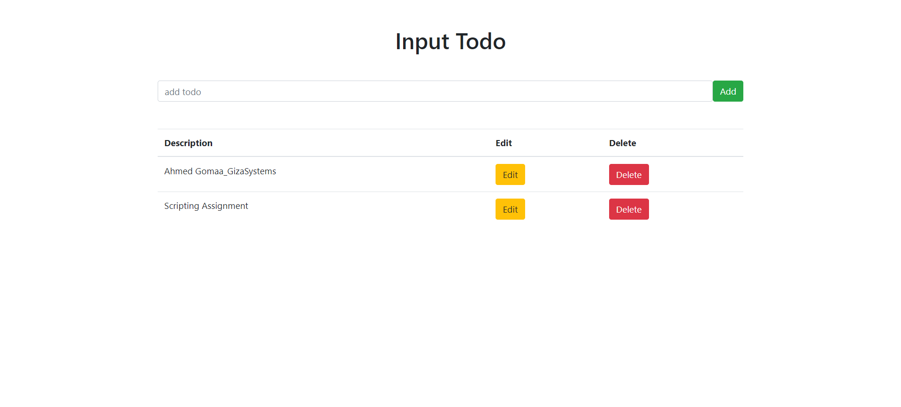

# Task Tracker Web Application (PERN Stack)

## Overview
This project is a full-stack **Task Tracker** web application, built using the **PERN** stack (PostgreSQL, Express, React, Node.js). The application features basic CRUD (Create, Read, Update, Delete) functionality for managing tasks. It integrates a React frontend with a Node.js backend, and the data is stored in a PostgreSQL database. The app is containerized with **Docker** and includes automation scripts for deployment and management on a cloud virtual machine (VM).
## CRUD API Endpoints
| Method | Endpoint          | Description                  |
|--------|-------------------|------------------------------|
| GET    | `/api/tasks`       | Retrieve all tasks           |
| GET    | `/api/tasks/:id`   | Retrieve a task by ID        |
| POST   | `/api/tasks`       | Create a new task            |
| PUT    | `/api/tasks/:id`   | Update a task by ID          |
| DELETE | `/api/tasks/:id`   | Delete a task by ID          |


## Technologies Used
- **React.js** (Frontend)
- **Node.js** with **Express.js** (Backend)
- **PostgreSQL** (Database)
- **Docker** and **Docker Compose** (Containerization)
- **Ubuntu** (Local and cloud VM environment)
- **cron** (For scheduling automated tasks)

## Project Structure

```
.
├── \033[36mDockerfile\033[0m                   # \033[33mDockerfile backend\033[0m
├── \033[36mclient/\033[0m                      # \033[33mFrontend directory\033[0m
│   ├── \033[36mDockerfile\033[0m               # \033[33mDockerfile for frontend service\033[0m
│   ├── \033[36mpackage-lock.json\033[0m        
│   ├── \033[36mpackage.json\033[0m             # \033[33mFrontend dependencies\033[0m
│   ├── \033[36mpublic/\033[0m                  
│   └── \033[36msrc/\033[0m/
│       ├── \033[36mApp.css\033[0m
│       ├── \033[36mApp.js\033[0m               # \033[33mMain React component\033[0m
│       ├── \033[36mcomponents/\033[0m          # \033[33mReusable React components\033[0m
│       ├── \033[36mindex.css\033[0m
│       └── \033[36mindex.js\033[0m
├── \033[36mdb.js\033[0m                        # \033[33mPostgreSQL connection\033[0m
├── \033[36mdocker-compose.yml\033[0m           # \033[33mDocker Compose file for backend, frontend, and PostgreSQL\033[0m
├── \033[36mindex.js\033[0m                     # \033[33mExpress.js backend entry point\033[0m
├── \033[36minit.sql\033[0m                     # \033[33mSQL file to initialize database and table\033[0m
├── \033[36mpackage-lock.json\033[0m            
├── \033[36mpackage.json\033[0m                 # \033[33mBackend dependencies\033[0m
├── \033[36mscripts/\033[0m                     # \033[33mAutomation scripts for Docker\033[0m
│   ├── \033[36mbuild.sh\033[0m                 # \033[33mScript to build Docker images\033[0m
│   ├── \033[36mrun.sh\033[0m                   # \033[33mScript to run Docker containers\033[0m
│   ├── \033[36mstop.sh\033[0m                  # \033[33mScript to stop containers\033[0m
│   ├── \033[36minstall-docker.sh\033[0m        # \033[33mScript to install Docker and Docker Compose\033[0m
│   └── \033[36mbackup.sh\033[0m                # \033[33mScript to back up the database\033[0m
├── \033[36mcrontab.txt\033[0m                  # \033[33mcron job for automating daily backups\033[0m

```


1. **Clone the Repository**:
```bash
    git clone https://github.com/gAhmedg/todo-app.git
    cd todo-app
```

2. **Set up Environment Variables**:
    Create a `.env` file to configure database settings:
    ```bash
    DB_HOST=db
    DB_USER=postgres
    DB_PASSWORD=yourpassword
    DB_NAME=tasks_db
    ```


## Assignment Breakdown

### Step 1: Develop the Web Application
- Built a **PERN stack** application with a React.js frontend and Node.js (Express) backend.
- Created API endpoints to handle CRUD operations with PostgreSQL.
- Developed a responsive React interface to manage tasks, allowing users to create, update, delete, and list tasks.
- Integrated PostgreSQL for data persistence, with backend logic for database communication.

### Step 2: Containerize the Application Using Docker
- Wrote separate `Dockerfiles` for the backend and frontend services.
```sh
# Dockerfile for backend
FROM node:12.12.0-alpine
WORKDIR /usr/src/app
COPY package*.json ./
COPY .env ./
RUN npm i
COPY . .
EXPOSE 5000
RUN cd client && npm install && npm run build
CMD ["npm", "start"]
```
```sh
# Dockerfile for front
FROM node:12.12.0-alpine
WORKDIR /app
COPY package*.json ./
RUN npm i
COPY . .
EXPOSE 3000
CMD ["npm", "start"]
```
- Used **Docker Compose** to define and manage multiple services (frontend, backend, and PostgreSQL database).
- Ensured images are optimized and unnecessary files are excluded.
```sh
# docker-compose.yml
version: '3.8'

services:
  postgres:
    image: postgres:12-alpine
    ports:
      - "5432:5432"
    environment:
      POSTGRES_PASSWORD: 1234pass
    volumes:
      - db-volume:/var/lib/postgresql/data 
      - ./init.sql:/docker-entrypoint-initdb.d/init.sql
    networks:
      - todos-network

  backend:
    container_name: node_api
    restart: unless-stopped
    
    build:
      context: .
      dockerfile: Dockerfile
    ports:
      - "5000:5000"
    depends_on:
      - postgres
    env_file:
      - .env
    networks:
      - todos-network

  frontend:
    container_name: react
    restart: unless-stopped
    build:
      context: ./client
      dockerfile: Dockerfile
    ports:
      - "3001:3000"
    stdin_open: true
    depends_on:
      - backend
    networks:
      - todos-network

networks:
  todos-network:

volumes:
  db-volume:  
```
### Local Development (Using Docker Compose)

1-  **Build and Start the Services**:
    In the root directory, run:
```bash
    docker-compose up --build
```

2- **Access the Application**:
- Frontend: Open `http://localhost:3001` in your browser.   


- Backend API: Accessible at `http://localhost:5000/api/tasks`.

3- **Stop the Application**:
```bash
    docker-compose down
```


### Step 3: Automate Docker Operations with Scripts
- Created shell scripts to:
  - Build Docker images (`build.sh`)
  - Run the containers (`run.sh`)
  - Stop the containers (`stop.sh`)
  then make the exasible 
```sh
  chmod +x build.sh run.sh stop.sh
```

### Step 4: Set Up a Cloud Virtual Machine (VM)
- Provisioned a cloud VM (on AWS EC2).
- Set up secure SSH access and necessary network configurations.
##

##
### Step 5: Automate Deployment to the Cloud VM
- By  clone repo for app and scripts
    - Installed **Docker** and **Docker Compose** using install_docker.sh .
- or Transfer Files to EC2 Ubuntu Instance Using SCP
```sh
scp -i key.pem -r /todo-app ubuntu@your-ec2-ip:/home/ubuntu/
```
- Run the Build Script
Now you can run the build.sh script to build your Docker images on the VM:

```bash
./scripts/build.sh
```
- Run the Application
After building the images, use the run.sh script to start the containers:

```bash
./scripts/run.sh
```
### Step 6: Secure the Application and Configured firewall rules in VM 
- Configured firewall rules to allow traffic only on the necessary ports (SSH, app port).


### Step 7: Implement an Automated Daily Task
- Set up a **cron job** on the VM to back up the PostgreSQL database daily.
    - test backup script 
    
    - Set Up cron to Run the Backup Daily:
```bash
    crontab -e
    0 0 * * * /home/ubuntu/backup.sh
```


